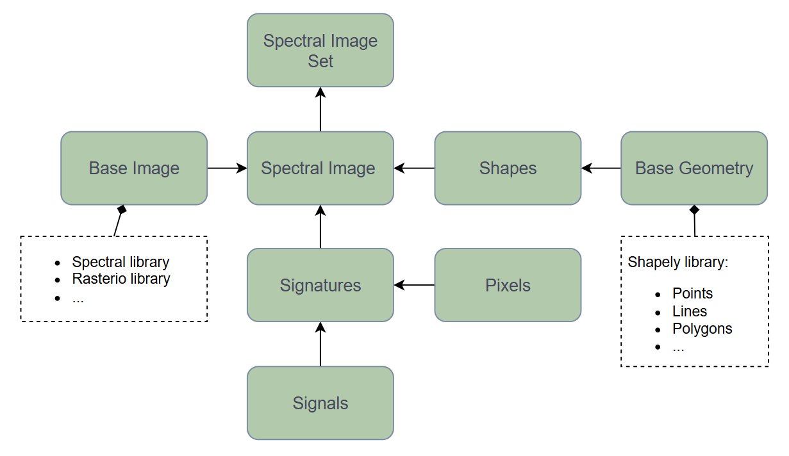

# Entities

Entities serve as the foundational data structures in SiaPy, representing key elements of spectral image analysis and processing workflows. They implement consistent, strongly-typed interfaces that allow seamless interaction between spectral data, spatial coordinates, and geometric information.

## Design principles

SiaPy's architecture follows several key design principles:

**Specialized yet compatible**: Each entity is optimized for its specific role while maintaining compatibility with the broader SiaPy ecosystem

**Independence**: Most entities can function independently (with the exception of abstract base classes)

**Composition over inheritance**:

- The composition is preferred, so that one class can leverage another by injecting it into its architecture
- Inheritance is primarily used to implement common interfaces through base classes

**Extensibility**:

- The `SpectralImage` class supports multiple data sources through *spectral* or *rasterio* libraries, however, custom data loading can be implemented by creating your own driver
- Basic geometric shapes (e.g. points, lines, polygons) are implemented using the *shapely* library, which could also be extended through base abstraction

The class structure is depicted in the following diagram:



## Spectral Image

A `SpectralImage` is the primary container for spectral image data. It's a generic class that can wrap different image backends, allowing you to work with various file formats through a unified interface.

### Image Initialization Options

#### 1. Load from ENVI format (using spectral python)

This is commonly used for hyperspectral imagery from airborne or satellite sensors.

```python
--8<-- "docs/concepts/src/spectral_image_01.py"
```

#### 2. Load from GeoTIFF or other geospatial formats (using rasterio)

Perfect for georeferenced data with spatial information.

```python
--8<-- "docs/concepts/src/spectral_image_02.py"
```

#### 3. Create from numpy array

Useful for testing or when you already have image data in memory.

```python
--8<-- "docs/concepts/src/spectral_image_03.py"
```

#### 4. Create your own custom image class

For specialized file formats or custom processing needs, you can extend the ImageBase class.

```python
--8<-- "docs/concepts/src/spectral_image_04.py"
```

## Pixels

The `Pixels` class represents spatial coordinates within spectral image, providing a container for *(x, y)* coordinate pairs. It uses pandas DataFrame internally for storage, enabling high-performance operations. The class provides multiple initialization methods and conversion functions to work with different data representations (i.e. DataFrames, list, arrays)

```python
--8<-- "docs/concepts/src/pixels_01.py"
```

## Signals

The `Signals` class stores spectral data for each pixel in a pandas DataFrame, allowing you to use any column names you choose (e.g. "band_1", "nir", "red_edge"). You can initialize it from a DataFrame, lists, dicts or NumPy arrays.

```python
--8<-- "docs/concepts/src/signals_01.py"
```

## Signatures

The `Signatures` class represents spectral data collections by combining spatial coordinates (`Pixels`) with their corresponding spectral values (`Signals`). It provides a unified container that maintains the spatial-spectral relationship, allowing for analysis of spectral information at specific image locations. Internally, the data is stored as pandas DataFrames for efficient operations and indexing.

```python
--8<-- "docs/concepts/src/signatures_01.py"
```

## Shape

The `Shape` class represents geometric shapes that can be associated with images, such as points, lines, and polygons.

```python
--8<-- "docs/concepts/src/shapes_01.py"
```

## SpectralImageSet

The `SpectralImageSet` class manages a collection of spectral images.

```python
--8<-- "docs/concepts/src/spectral_image_set_01.py"
```
