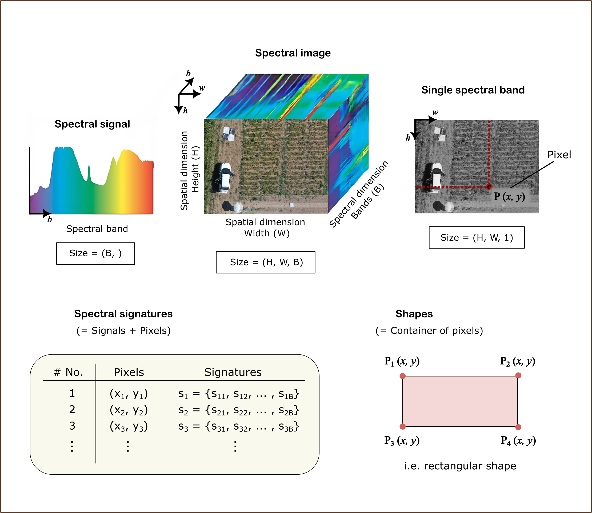

# Entities

??? note "API Documentation"
    `siapy.entities`

Entities serve as the foundational data structures in SiaPy, representing key elements of spectral image analysis and processing workflows. They implement consistent, strongly-typed interfaces that allow seamless interaction between spectral data, spatial coordinates, and geometric information.

## Module architecture

The relationships between components are shown in the following diagram:


### Design principles

SiaPy's architecture follows several key design principles:

**Specialized yet compatible**: Each entity is optimized for its specific role while maintaining compatibility with the broader SiaPy ecosystem

**Independence**: Most entities can function independently (with the exception of abstract base classes)

**Composition over inheritance**:

- The composition is preferred, so that one class can leverage another by injecting it into its architecture
- Inheritance is primarily used to implement common interfaces through base classes

**Extensibility**:

- The `SpectralImage` class supports multiple data sources through *spectral* or *rasterio* libraries, however, custom data loading can be implemented by creating your own driver
- Basic geometric shapes (e.g. points, lines, polygons) are implemented using the *shapely* library, which could also be extended through base abstraction

### Visual representation of spectral entities

The components follow standard naming conventions for spectral image analysis. A `SpectralImage` represents a three-dimensional data cube (height × width × bands). Each pixel in this cube has spatial coordinates *(x, y)* and a corresponding spectral signal with values across all bands.

A signature combines a pixel's spatial location with its spectral signal, creating a complete spatial-spectral data point. The `Signatures` class serves as a container for multiple such data points, enabling analysis across collections of pixels.

Since spectral images often contain distinct objects with different spectral properties, `Shapes` (regions of connected pixels) allow for extraction and analysis of specific areas. The `SpectralImage` class therefore integrates all primitive structures: `Pixels` and `Signals` by definition, and `Shapes` when attached to the image.



| Name                            | What it represents                                                                                                                                    | Shape / size                               |
| ------------------------------- | ----------------------------------------------------------------------------------------------------------------------------------------------------- | ------------------------------------------ |
| **`Spectral image`**             | A single hyperspectral or multispectral data cube.                                                                     | **`(H, W, B)`** → *height × width × bands* |
| **`Spectral image set`**          | An ordered collection of `SpectralImage` objects. Think of it as a “dataset” with convenience methods that loop internally instead of in user code.   | *N* × `SpectralImage` for *N* spectral images |
| **`Pixels`** | One Cartesian coordinate **`(x, y)`**.                                | **`(N, 2)`** for *N* pixels                |
| **`Shapes`**                     | A geometric region of interest (e.g. rectangle, polygon, circle), serving as a *container of pixels*. | Vector geometry                            |
| **`Signatures`**         | A collection of 1-D spectral signals **`(B,)`** tied to pixel values **`(x, y)`** or aggregated over a shape.                                                        |   **`(N, B + 2)`** → *N* signatures, each with *B* spectral bands plus **`(x, y)`** coordinates |

## Pixels

??? api "API Documentation"
    [`siapy.entities.Pixels`][siapy.entities.Pixels]<br>

The `Pixels` class represents spatial coordinates within spectral image, providing a container for *(x, y)* coordinate pairs. It uses pandas DataFrame internally for storage, enabling high-performance operations. The class provides multiple initialization methods and conversion functions to work with different data representations (i.e. DataFrames, list, arrays)

```python
--8<-- "docs/concepts/src/pixels_01.py"
```

## Signals

??? api "API Documentation"
    [`siapy.entities.signatures.Signals`][siapy.entities.signatures.Signals]<br>

The `Signals` class stores spectral data for each pixel in a pandas DataFrame, allowing you to use any column names you choose (e.g. "band_1", "nir", "red_edge"). You can initialize it from a DataFrame, lists, dicts or NumPy arrays.

```python
--8<-- "docs/concepts/src/signals_01.py"
```

However, direct initialization of `Signals` is typically not necessary in practice. When you create a `Signatures` instance, the underlying `Signals` object is automatically generated and managed for you. This section demonstrates the `Signals` class primarily to illustrate how the `Signatures` class (discussed next) is composed internally and to provide insight into the data structure that powers spectral analysis.

## Signatures

??? api "API Documentation"
    [`siapy.entities.Signatures`][siapy.entities.Signatures]<br>

The `Signatures` class represents spectral data collections by combining spatial coordinates (`Pixels`) with their corresponding spectral values (`Signals`). It provides a unified container that maintains the spatial-spectral relationship, allowing for analysis of spectral information at specific image locations. Internally, the data is stored as pandas DataFrames for efficient operations and indexing.

`Signatures` can be initialized in multiple ways. The explicit approach creates each component separately before combining them, providing clarity about the composition:

```python
--8<-- "docs/concepts/src/signatures_01.py:long"
```

For more concise code, you can initialize a `Signatures` object directly from coordinate and signal values:

```python
--8<-- "docs/concepts/src/signatures_01.py:short"
```

Both approaches yield equivalent results when initialized with the same data. You can access and work with the data using various DataFrame operations and conversion methods:

```python
--8<-- "docs/concepts/src/signatures_01.py:assert"
```

## Shape

??? api "API Documentation"
    [`siapy.entities.Shape`][siapy.entities.Shape]<br>

The `Shape` class represents geometric shapes that can be associated with images, such as points, lines, and polygons.

```python
--8<-- "docs/concepts/src/shapes_01.py"
```

## Spectral Image

??? api "API Documentation"
    [`siapy.entities.SpectralImage`][siapy.entities.SpectralImage]<br>

A `SpectralImage` is the primary container for spectral image data. It's a generic class that can wrap different image backends, allowing you to work with various file formats through a unified interface.

### Image Initialization Options

#### 1. Load from ENVI format (using spectral python)

This is commonly used for hyperspectral imagery from airborne or satellite sensors.

```python
--8<-- "docs/concepts/src/spectral_image_01.py"
```

#### 2. Load from GeoTIFF or other geospatial formats (using rasterio)

Perfect for georeferenced data with spatial information.

```python
--8<-- "docs/concepts/src/spectral_image_02.py"
```

#### 3. Create from numpy array

Useful for testing or when you already have image data in memory.

```python
--8<-- "docs/concepts/src/spectral_image_03.py"
```

#### 4. Create your own custom image class

For specialized file formats or custom processing needs, you can extend the ImageBase class.

```python
--8<-- "docs/concepts/src/spectral_image_04.py"
```

## Spectral Image Set

??? api "API Documentation"
    [`siapy.entities.SpectralImageSet`][siapy.entities.SpectralImageSet]<br>

The `SpectralImageSet` class manages a collection of spectral images.

```python
--8<-- "docs/concepts/src/spectral_image_set_01.py"
```
